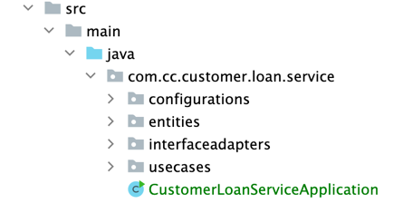
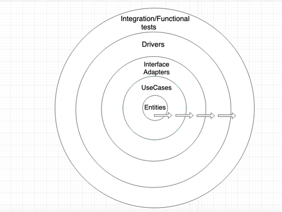

# Customer Loan service :
Consider below is the business use case shared by a business team on which this sample application is built :
1. Receive request to create a new Loan (car/home)
2. Check if customer is fraud or not
3. if fraud, don't create a new loan, respond with error
4. if not fraud, create a new Loan
5. Save the loan to DataStore
6. Respond with Loan information

# Clean Architecture :


# Package structure reflecting Clean Architecture layers :



# What does each layer mean :

1. **_Entities_** - The place where our enterprise business rules resides (_NOT a layer with just plain old java object having getters & setters - rather the actual behaviours/functions is encapsulated, if following DDD this is the place where the domain concepts resides_)
2. **_UseCases_** - The place where our application business rules resides, which controls the dance of Entities
3. **_InterfaceAdapters_** - The place where implementation for database, http call , interfaces defined in UseCase resides
4. **_Drivers_** - The place where all the independent components are stitched together to form an application (web)

## Additional test layers :
1. **_Functional-tests_** - The place where all high-level functional(business use cases) integration tests reside
2. **_Integration-tests_** - The place where all technical (database/rest integration, retries, timeout etc.) integration tests reside

## Boundaries :

```text
    Clear boundaries defined :
    - Entities doesn't know anything about its outer circles  (i.e UseCases, InterfaceAdapters, configurations layer).
    - UseCases doesn't know anything about its outer circles  (i.e InterfaceAdapters, configurations layer), but knows about its inner circles (i.e Entities)
    - InterfaceAdapters doesn't know anything about its outer circles (i.e Drivers), but knows about its inner circles (i.e Entities, UseCases layer)
    - Drivers doesn't know anything about Functional-test/Integration-test, but knows about its inner circles (i.e InterfaceAdapters, Entities, UseCases layer)
    - Functional-tests know every layer
    - Integration-tests know every layer
```


# Why Clean Architecture :

1. _**Entities & UseCases layers are central and every other layers support  them**_ - which means our application is purely driven by business aspects and not from technical perspective
2. **_Easy maintenance_**  -
    1. Separation of concerns of,
        1. business vs technical
        2. framework dependent vs framework in-dependent
        3. unit tests vs integration tests vs functional tests
3. **_Refactor friendly_** - Easy to refactor applications (consider scenarios of getting rid of frameworks like reactor/springboot, and this can be done without affecting the domain layers )
4. **_Independent of external interactions_** - Changes in the external http contract or database doesn't affect the Entities & UseCases (unless its required to update the domain with business logics)
5. **_Evolving architecture_** -
    1. Domain is evolved free from the external dependencies
    2. The rate at which the entity/usecases evolve (more frequent ?) as compared to interfaceadapters/drivers (less frequent ?) are totally different.

# How does a typical development happens ?
    
Development flow :



# Note:
This follows the reactive based implementation (project reactor/ spring webflux) - https://projectreactor.io/docs/core/3.6.6/reference/index.html

# References :
1. https://www.oreilly.com/library/view/clean-architecture-a/9780134494272/
2. https://projectreactor.io/docs/core/3.6.6/reference/index.html
3. https://www.youtube.com/watch?v=xF7aZJlfTSw - for reactor logging
